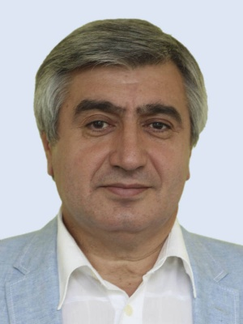

Защита проходила в режиме онлайн, мы рассказываем вам о первых
работах на защите 24 июня 2021 года.

Анна Чагаева оценила эффект от внедрения цифровых пломб
в развитии транзита по транспортным коридорам. Анна проходила стажировку
в ГК "Роскомос", поддерживающей спутниковую систему, которая участвует
в трекинге грузов.

Ссылка по теме: [Мониторинг транзитных перевозок с использованием навигационных пломб](https://www.youtube.com/watch?v=OxlKFuJxMow)

Владимир Гурьев поставил перед собой сложную задачу оценить эффекты и риски
от возможного перехода к системам общего искусственного интеллекта (AGI) в коммерческом банке, в случае их появления.

Ссылка по теме: [An executive primer on artificial general intelligence](https://www.mckinsey.com/business-functions/operations/our-insights/an-executive-primer-on-artificial-general-intelligence#)

Анастасия Куликова рассмотрела новый бизнес-процесс и технологическое решение
для гарантирования налоговых рисков трансфертного ценообразования
в международной компании.

Ссылка по теме:
[OECD Transfer Pricing Guidelines for Multinational Enterprises and Tax Administrations][oecd]

[oecd]: https://www.oecd.org/tax/transfer-pricing/oecd-transfer-pricing-guidelines-for-multinational-enterprises-and-tax-administrations-20769717.htm

Анастасия Денисова раскрыла возможности повышения эффективности
работы с клиентами за счет внедрения средств бизнес-аналитики на
агропредприятии.

Ссылка по теме: [Analytics and Business Intelligence (BI) Platforms Reviews and Ratings](https://www.gartner.com/reviews/market/analytics-business-intelligence-platforms)

Студенты использовали в своих дипломных работах результаты,
полученные в ходе практик и стажировок, многие уже начали работу
в выбранных компаниях.

#### Состав государственной экзаменационной комиссии по направлению подготовки 38.03.02 Менеджмент, профиль «Управление внешнеэкономической деятельностью»

 

Председатель комиссии Степанов Виталий Андреевич, кандидат экономических наук, заместитель генерального директора автономной некоммерческой организации «Московский экспортный центр»
  
Члены комиссии:
1. Погребняк Евгений Владимирович, кандидат экономических наук, декан факультета финансовой экономики Одинцовского филиала МГИМО МИД России
2. Василюк Татьяна Николаевна, кандидат экономических наук, доцент, заведующий кафедрой менеджмента Одинцовского филиала МГИМО МИД России
3. Сысоева Елена Васильевна, кандидат экономических наук, доцент кафедры менеджмента Одинцовского филиала МГИМО МИД России
4. Бондаренко Алексей Валерьевич, кандидат экономических наук, доцент кафедры менеджмента Одинцовского филиала МГИМО МИД России, генеральный директор общества с ограниченной ответственностью «Астема Групп»
5. Тарусин Виктор Иванович, Президент Союза Одинцовская торгово-промышленная палата
6. Салтыков Михаил Геннадьевич, начальник планового отдела ГК «DOOR HAN».

#### Состав государственной экзаменационной комиссии по направлению подготовки 38.03.01 Экономика, профиль «Информационные технологии в международном бизнесе»

 

Председатель государственной экзаменационной комиссии: Вартанян Аревшад Апетович д-р эконом. наук, профессор кафедры информационных технологий в государственном управлении института инновационных технологий и государственного управления Федерального государственного бюджетного образовательного учреждения высшего образования Российского технологического университета (РТУ МИРЭА)

Члены государственной экзаменационной комиссии:

1. Погребняк Евгений Владимирович канд. экон. наук, декан факультета финансовой экономики Одинцовского филиала ФГАОУ ВО МГИМО МИД России
2. Притчина Лариса Сергеевна канд. техн. наук, заведующий кафедрой математических методов и бизнес-информатики, заместитель директора Одинцовского филиала ФГАОУ ВО МГИМО МИД России
3. Пятов Алексей Александрович канд. экон. наук, старший консультант дирекции по управлению технологическими решениями ООО «САС Институт»
4. Лебедев Илья Олегович ведущий инженер – технический руководитель ООО «Мейл.ру».
